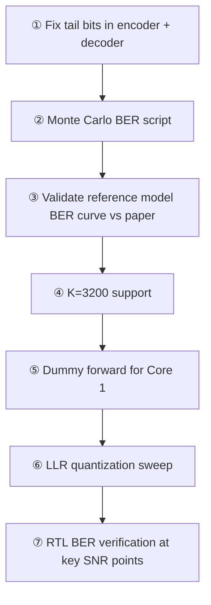

# Plan: Reproducing the Studer et al. Paper BER Curve

> Current repository note, 2026-04-29: this file is historical planning context.
> The active RTL target has been retargeted to `K=3200`, `N=2`, `S=1600`,
> LTE tail enabled, paper boundary mode enabled, QPP `f1=111`, `f2=240`, and
> `data/qpp_3200.hex`. The old K=6144/QPP artifacts were moved to
> `archive/cleanup_20260429/`. For current commands and results, see
> `docs/debug_changes.md`, `docs/implementation_report.md`, and
> `data/README_current.md`.

You're right — the RTL is functionally correct (0/6144 mismatch vs reference), but it does **not** yet reproduce the paper's Fig. 9 BER curve. Here's a systematic breakdown of every gap and what to do about each.

---

## Current State vs Paper

| Aspect | Paper (Studer et al. 2011) | Current RTL | Gap |
|--------|---------------------------|-------------|-----|
| Block length | K=3200 (BER curves) | K=6144 | Different K |
| Trellis termination | Proper LTE 12-bit tail | Bit-flipping hack | **CRITICAL** |
| Parallel boundary init | Dummy forward recursion | Equal-alpha lockstep | Moderate |
| Test methodology | Monte Carlo, many frames | Single frame | Not statistical |
| N (parallelism) | 8 SISOs | 2 SISOs | Architecture |
| Eb/N0 sweep | Full curve 0–3 dB | Single point 1.0 dB | Incomplete |

---

## Priority-Ordered Fixes

### ① LTE Tail Bits — CRITICAL (you're right!)

This is **the most important fix**. The current test vector generator (`gen_encoded_test_vectors.py`) uses a hack: it flips information bits near the end to force both encoders to end in state zero. This is invalid for two reasons:

1. **It corrupts the information bits** — the "true" bits are modified, so the BER measurement is against corrupted reference bits
2. **It doesn't match the LTE spec** — real LTE uses 12 explicit tail bits (6 per encoder)

#### What LTE Actually Does (3GPP TS 36.212)

After encoding K information bits, 12 extra bits are generated:

```
Encoder 1 termination (3 clock cycles):
  Switch input to feedback path → forces shift register to 0
  Output: x_{K}, z_{K}, x_{K+1}, z_{K+1}, x_{K+2}, z_{K+2}
  
Encoder 2 termination (3 clock cycles):  
  Switch input to feedback path → forces shift register to 0
  Output: x'_{K}, z'_{K}, x'_{K+1}, z'_{K+1}, x'_{K+2}, z'_{K+2}
```

Total transmitted bits: K systematic + K parity-1 + K parity-2 + 12 tail bits.

#### What Needs to Change

**In `gen_encoded_test_vectors.py`:**

```python
def lte_constituent_encode_with_tail(info_bits):
    """Encode K bits + 3 tail bits to terminate trellis."""
    K = len(info_bits)
    sys_bits = np.zeros(K + 3, dtype=int)
    par_bits = np.zeros(K + 3, dtype=int)
    
    sys_bits[:K] = info_bits  # First K bits are info
    s = [0, 0, 0]
    
    # Encode K information bits (normal)
    for k in range(K):
        feedback = info_bits[k] ^ s[1] ^ s[2]
        par_bits[k] = feedback ^ s[0] ^ s[2]
        s[2] = s[1]; s[1] = s[0]; s[0] = feedback
    
    # 3 termination steps: input = feedback (forces state to 0)
    for k in range(3):
        # Tail systematic bit = feedback value (NOT info bit)
        tail_input = s[1] ^ s[2]  # feedback without XOR with input
        sys_bits[K + k] = tail_input
        feedback = tail_input ^ s[1] ^ s[2]  # = 0 always during termination
        par_bits[K + k] = feedback ^ s[0] ^ s[2]
        s[2] = s[1]; s[1] = s[0]; s[0] = feedback
    
    assert s == [0, 0, 0], "Encoder did not terminate to zero!"
    return sys_bits, par_bits
```

> [!IMPORTANT]
> The tail bits must be included in the **decoder's trellis** too. The decoder needs to process K+3 systematic and parity values per constituent encoder for the tail region. In the windowed architecture, the tail bits simply appear as extra trellis steps at the end of the last window.

**In the RTL decoder:**
- The tail bits need to be loaded into the input BRAMs as additional trellis steps
- The backward recursion of the last core already uses known terminal β(S0)=0, so the tail bits just help the decoder converge better
- Frame length for the decoder becomes K+3 per encoder (but BER is still measured on the K information bits only)

> [!WARNING]
> The tail bit handling is somewhat subtle:
> - Encoder 1 tail region: 3 sys+par pairs appended AFTER the K-th systematic bit
> - Encoder 2 tail region: 3 sys+par pairs appended AFTER the K-th interleaved bit
> - During the tail, the "systematic" bits are NOT information bits — they're feedback-derived
> - The decoder processes them but does NOT include them in the BER count

#### Practical approach

For simplicity, you can handle the tail bits in two ways:

**Option A (Simpler):** Just include them as extra trellis steps at the end. The last window's trellis will see K, K+1, K+2 as valid positions with their own sys/par values from the tail sequence.

**Option B (What the paper likely does):** Treat the tail bits as "known" — since the decoder already assumes terminal state 0, the tail bits primarily help the last backward recursion have better initial metrics. With proper terminal-beta initialization, the impact is small but measurable at low SNR.

---

### ② Monte Carlo BER Simulation

The paper's Fig. 9 shows BER at multiple Eb/N0 points, computed over many transmitted frames until enough bit errors are collected. The current setup uses **one frame** at **one SNR**.

**What to build:** A Python wrapper that:
1. Generates N random frames (different seeds)
2. Encodes each with proper tail bits
3. Adds AWGN at a given Eb/N0
4. Quantizes to 5-bit
5. Writes BRAM files, runs the RTL simulation (or reference model)
6. Collects BER across all frames
7. Repeats for each Eb/N0 point

```python
# Pseudocode for Monte Carlo BER
for ebn0 in [0.0, 0.5, 1.0, 1.5, 2.0, 2.5, 3.0]:
    total_bits = 0
    total_errors = 0
    while total_errors < 200:  # Need enough errors for statistical significance
        frame = generate_random_frame()
        encoded = turbo_encode_with_tail(frame)
        received = awgn_channel(encoded, ebn0)
        quantized = quantize_5bit(received)
        decoded = run_decoder(quantized)  # RTL or reference
        errors = count_errors(frame, decoded)
        total_bits += K
        total_errors += errors
    ber[ebn0] = total_errors / total_bits
```

For the RTL, running Icarus for each frame is slow. **Start with the Python reference model** for the Monte Carlo sweep, then spot-check the RTL at key SNR points.

---

### ③ Dummy Forward Recursion for Non-Zero Cores

The paper uses dummy forward recursion to warm up alpha metrics at segment boundaries. The current 2-core RTL skips this for Core 1, using all-zero alpha instead.

**Impact:** ~0.1–0.3 dB BER loss at the segment boundary. This is the "parallel-boundary loss" mentioned in the debug doc.

**Fix:**
- Add a dummy forward pass before the first real forward window for Core 1
- This requires an extra 15-cycle window slot at startup
- The cores would no longer be in perfect lockstep for that first slot, so the top-level BRAM write logic needs adjustment (or just stall Core 0's output for those 15 cycles)

---

### ④ K=3200 Support

The paper uses K=3200, not K=6144. Different K means different QPP parameters.

| K | f1 | f2 |
|---|----|----|
| 3200 | 111 | 240 |
| 6144 | 263 | 480 |

**Fix:** Make K, f1, f2, S, NUM_WINDOWS parameterizable in:
- `gen_encoded_test_vectors.py`
- `turbo_ref_model.py`
- `full_block_float_turbo.py`
- RTL: `turbo_decoder.v` already has `FRAME_LEN` and `NUM_WINDOWS` as localparams; make them proper parameters

---

### ⑤ LLR Quantization Optimization

The current quantization scale is `max_val / 4.0 = 15/4.0 = 3.75`. This may not be optimal for all SNR points. The paper likely optimized the quantization scale.

**Fix:** Sweep the quantization scale factor and pick the one that minimizes BER at each Eb/N0 point (or use a single good compromise value).

---

## Recommended Implementation Order



### Phase 1: Get the algorithm right (Python only)
1. Fix `gen_encoded_test_vectors.py` with proper tail bits
2. Update `full_block_float_turbo.py` to handle tail bits  
3. Build Monte Carlo BER sweep script
4. Run floating-point max-log BER curve → should closely match Fig. 9 baseline
5. Run fixed-point windowed reference model BER curve → quantify quantization + windowing loss

### Phase 2: RTL updates
6. Update RTL to handle tail bits (extend last window by 3 steps or add tail-bit BRAM entries)
7. Add dummy forward recursion for Core 1
8. Run RTL BER at key SNR points → should match fixed-point reference

---

## What NOT to Worry About (Yet)

- **N=8 parallelism**: The paper uses 8 cores but BER is the same regardless of N (with proper boundary initialization). Our N=2 is fine for BER validation.
- **Log-MAP vs Max-Log**: The paper uses max-log with 0.6875 scaling, which is what we have. The loss vs log-MAP is only ~0.1 dB.
- **Clock frequency / throughput**: These are implementation metrics, not BER-affecting.

---

## Expected Results After Fixes

With proper tail bits + Monte Carlo + K=3200:
- **Floating-point max-log BER** should be within ~0.05 dB of the paper's reference curve
- **Fixed-point windowed (M=30) BER** should be within ~0.15 dB of floating-point
- **RTL BER** should match fixed-point windowed exactly (0 mismatches, as currently verified)
- **Total implementation loss** vs ideal: < 0.2 dB (paper reports < 0.14 dB)

> [!TIP]
> **Start with Phase 1** — it's all Python, no Verilog changes needed, and it will tell you exactly how much BER you're losing to each approximation. Only move to Phase 2 (RTL changes) once the Python models match the paper.
